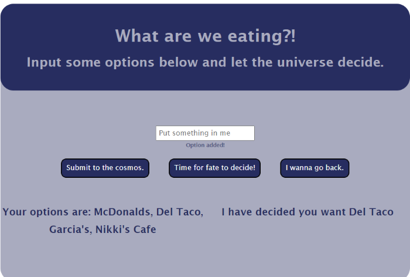

# Meal Decider #

## Contents ##

---

1. About
2. Screenshots
3. Links

---

 
 

### About ###

---

My wife and I can never decide what we want to eat. The endless debate of "I don't care, you pick" or "I don't know what I want, what do you want?" and my personal favorite: "I don't care... ...I don't want that". Gone are the days of her and I debating and arguing what we want to eat. Rather than provide all of the wrong options and ultimately just settling for something none of us really want, I built us the Meal Decider.

Using javascript and some real basic HTML/CSS I created a tool to settle these debates. By typing in an option into the text box and submitting that option to the cosmos, you will build an array of possible meal options of your choosing. As you submit options, you will find a list of options you have submit so you don't accidentally duplicate options or, just so you can see what you input. When you have provided what you consider to be a satisfactory list of options, let fate decide where you will eat. At this point JS will iterate through the built array and choose one at random which will then be displayed on screen. 

Easy.

In the event that you submit blank options or attempt to have the app truly make something up by not giving it options you will receive alerts prompting you to comply. JS will also reject empty options into the array should you leave the text box blank by accident upon submission.

---

 
 

### Screenshots ###

---

 

---

 

---

 
 

### Links ###

---

 

GitHub repositories: https://github.com/JDReeves86?tab=repositories

Portfolio: https://jdreeves86.github.io/02challengeTurnIn/

Meal Decider live page: https://jdreeves86.github.io/mealDecider/

LinkedIn: https://www.linkedin.com/in/jacob-reeves-4237a9238/